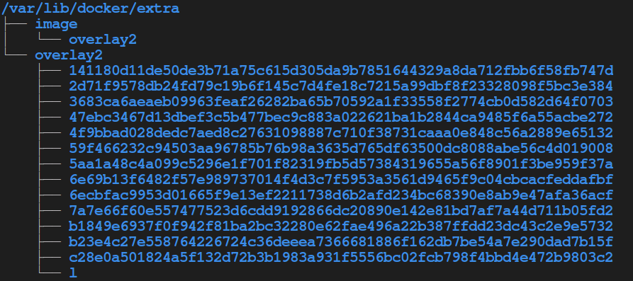

# Docker-Extra

The docker-extra branch is based on [moby](https://github.com/moby/moby) project, it modifies the code to allow docker pull from a extra image storage when downloading images.

## Introduction

Pulling a big image from remote registry can be very slow, while a container only needs a little data to boot up accroding to some expriments, so it's effcient that docker have the access to some extra image layer storage, e.g. NFS layer storage, which stores uncompressed image data, then a container can be started just upon the layer storage and the data is requested through wire in a so called "Lazy" way.

docker-extra project provides a way to allow docker work with those extra (may be shared) storage, which speed up the creation of container.

## Features

We add some other options to dockerd's config file (/etc/docker/daemon.json):
```json
{
    "extra-storage":{
        "path":"path-to-the-extra-storage-dir-on-host[default:/var/lib/docker/extra]",
        "device":"path-to-the-device-to-be-mount-on-path",
        "type":"mount-type"
    }
}
```
If the extra storage is just a dir on host, then the `path` option is enough. If the extra storage is intalled as a device and should be mount on the dir `path`, users should specify the path of the device (e.g. /dev/sdb0) and also the type of the file system (e.g. ext4)

## Extra Storage Requirment

File structure of extra storage dir should be like the one below



It's easy to create a required extra storage structure, you can just copy the `image` and `overlay2` from `/var/lib/docker/`.

## Kubernetes

There is also a modified Kubernetes which works properly with docker-extra